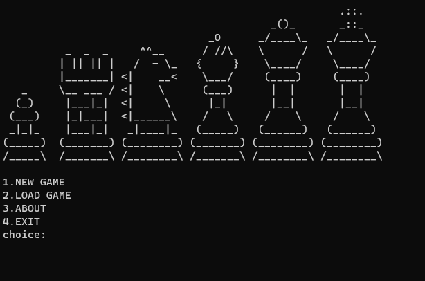
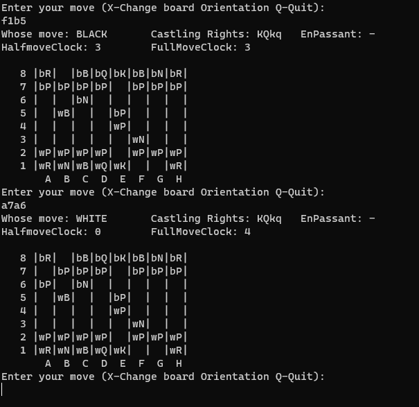

# AnotherChessGame

An engine that allows you to play chess. Displayed in the console with the possibility of connecting to GUI.
You can:
- play the classic version
- play [Fisher random](https://en.wikipedia.org/wiki/Fischer_random_chess)
- load game from [FEN](https://en.wikipedia.org/wiki/Forsyth%E2%80%93Edwards_Notation)




## Usage
```powershell
java -jar AnotherChessGame-1.0.jar cmd
```